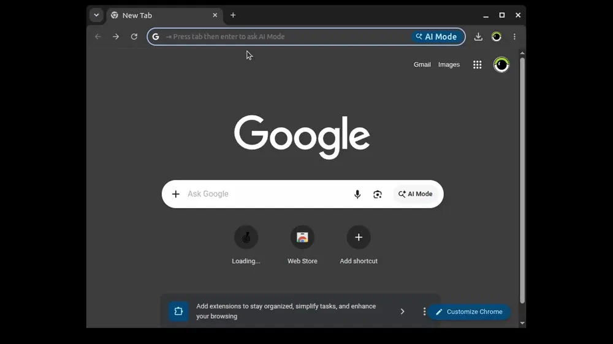
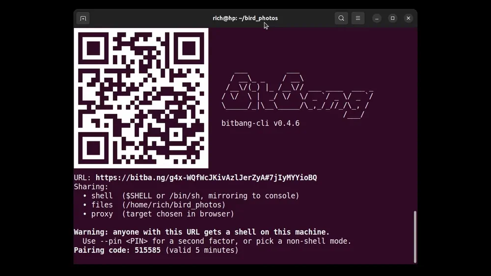

# bitbang 

`bitbang` is a remote-access multitool: open an interactive shell, browse and transfer files, and use web apps on a remote machine's network -- all from any browser, with no SSH, no port forwarding, and no account.

[](https://github.com/richlegrand/bitbang-cli/actions/workflows/tests.yml)




On the machine you want to reach:

```
curl -sSfL bitba.ng/install | sh
bitbang serve
```

`serve` prints a URL. Open it in any browser and you get a terminal, a file browser, and a proxy to that machine's network -- or connect from another terminal with `bitbang connect <url>` using the same binary. The connection is end-to-end encrypted and peer-to-peer; the `bitba.ng` server introduces the two ends, then steps aside.

`bitbang` is a single static Go binary. It's part of the [BitBang project](https://github.com/richlegrand/bitbang); this [whitepaper](https://github.com/richlegrand/bitbang/blob/main/whitepaper.md) covers the design in depth.

## Pairing with a 6-digit code

When you can't paste a URL or scan a QR code -- you're on the phone, or within yelling distance -- `bitbang serve` also prints a short **pairing code**. The other party opens `bitba.ng/<code>` (or runs `bitbang connect <code>`), their screen shows a second 6-digit number, and they read *that* one back to you. You type it in to approve. A machine-in-the-middle can't make the two numbers match, and pairing saves the device connection credentials for next time, e.g. `bitbang connect nas1`.



## Why

- **Nothing to forward or configure.** Works from behind NAT, CGNAT, or a locked-down network -- no router changes, no VPN, no tunnel daemon.
- **Nothing to install on the connecting side.** A browser is enough. A CLI is there when you want scripting, pipes, and file copy.
- **Private by design.** Traffic is WebRTC/DTLS, peer-to-peer. The signaling server never sees it; if a direct path isn't possible, a TURN relay carries ciphertext only.
- **No account, no telemetry.**

**Why not just use SSH?** For a machine you can already SSH into comfortably, `bitbang` has limited utility, unless you want access from outside your network, generic proxying, or a browser as the client. For every other machine, the difference is setup and reach. SSH has to be enabled and configured before it will let you in. For example, it's disabled by default on Raspberry Pi OS, and it's often enabled with key-only access, meaning your public key has to get onto the machine first. And how do you do that? Email or a USB stick are usually the most painless options. `bitbang` can set up the connection with a 6-digit code exchange instead -- something you can do safely over the phone, or even call out across the room. SSH also needs an open port, and opening one to the outside world isn't straightforward. If you want to proxy a web app on the machine's network, SSH gives you a separate tunnel per app, named in advance. The `bitbang` proxy is generic: specify the web app's URL at connection time. In short, `bitbang` requires no root, no open port, and no config to grapple with -- and it offers simple pairing, access from outside your network, generic proxying, and a browser as the client.

## Using `bitbang`

Every connection has two ends: a **listener** (`bitbang serve`, running on the machine being reached) and a **connector** (a browser, or the `bitbang` CLI, on the machine doing the reaching). One listener URL serves both kinds of connector.

### The listener: `bitbang serve`

```
bitbang serve                    # everything: shell + files + proxy on one URL
bitbang serve shell              # shell only
bitbang serve files ~/share      # files only (add -upload to allow uploads)
bitbang serve proxy              # proxy; pick the target in the browser
bitbang serve proxy localhost:8080   # ...or pin a single target
```

Each prints a QR code, URL and a pairing code.

### Connecting from a browser

Open the URL. Depending on what's served, you get:

- **Shell** -- a full terminal in the page (colors, resize, copy/paste).
- **Files** -- browse, preview, download, and upload.
- **Proxy** -- type a LAN address (`nas.local`, `192.168.1.10:8080`, `localhost:3000/admin`) and use the app as if you were local. Logins, cookies, uploads, and streaming all work.

<!-- TODO: per-feature demos -->
<!--  -->
<!--  -->

### Connecting from the CLI

```
bitbang connect <url>                                   # interactive shell
bitbang connect <url> -- tail -f /var/log/syslog        # one-shot command
bitbang cp <url>:/var/log/app.log ./app.log             # copy files, scp-style
bitbang cp - <url>:/tmp/firmware.bin < firmware.bin     # stdin/stdout work too
```

Every successful connect or pairing is saved to `~/.bitbang/devices.json`, so from then on a short name is enough: `bitbang connect nas1`.

## Install

The one-liner detects your arch (`amd64`, `arm64`, `armv7`), downloads the binary from the latest [GitHub release](https://github.com/richlegrand/bitbang-cli/releases), verifies its SHA-256 against the release's `checksums.txt`, and installs to `~/.local/bin/bitbang`.

Pin a version, change the location, or audit the script first:

```
curl -sSfL bitba.ng/install | sh -s -- --version v0.5.0
curl -sSfL bitba.ng/install | sh -s -- --prefix /usr/local/bin

curl -sSfL bitba.ng/install -o install.sh && less install.sh && sh install.sh
```

macOS and Windows builds are coming -- issues have been created for each ([macOS](https://github.com/richlegrand/bitbang-cli/issues/2), [windows](https://github.com/richlegrand/bitbang-cli/issues/1), just react or post to show me you're insterested . **Manual install:** download the binary from Releases and place it on your PATH. **Build from source:** see [below](#building-from-source).

### How the install URL works

`bitba.ng/install` is a redirect, not a hosted script. The chain:

1. `curl` hits `https://bitba.ng/install`, which 302s to [`install.sh`](install.sh) in this repo (on `main`).
2. The script runs in your shell, detects OS+arch, and downloads the binary asset from `https://github.com/richlegrand/bitbang-cli/releases/latest/download/bitbang-linux-<arch>`.
3. It fetches `checksums.txt` from the same release and verifies the binary's SHA-256.
4. Installs to `~/.local/bin` (overridable).

The install script lives in this repo, next to the code it installs -- so you can review it alongside the binary, and the canonical bitba.ng host owns only the short URL. Self-hosters can point their own host's `/install` at whatever script they ship: the signaling server's `INSTALL_URL` env var controls the redirect target (empty → 404).

## Security

- **Self-certifying identity.** On first run, `bitbang` generates an RSA keypair under `~/.bitbang/<program>/`; the device UID is derived from the public key, so impersonating a device means finding a second preimage of its UID.
- **The secret never touches the server.** The access code lives in the URL fragment (`#…`), which browsers never send -- `bitba.ng` brokers the connection without ever seeing the credential that authorizes it.
- **End-to-end encryption.** All traffic rides WebRTC's DTLS. The signaling server sees only the public key, the derived UID, and connection metadata -- never your data. A TURN relay, if one is needed, sees ciphertext only.
- **Verified pairing.** The read-aloud number in code pairing is a short authentication string (SAS), computed independently on both ends from the negotiated DTLS fingerprints and two committed nonces -- a machine-in-the-middle, whose fingerprints necessarily differ, can't make the two numbers match.
- **Optional PIN** (`--pin`) for permanent or headless setups, and **throwaway mode** (`-ephemeral`) for a fresh identity each run.

How the two ends authenticate each other without trusting the signaling server is covered in detail here: [*Trustless Signaling: Authentication Without a Central Authority*](https://github.com/richlegrand/bitbang/blob/main/trustless-signaling.md).

## How it compares

|                                 | ngrok         | Cloudflare Tunnel | Tailscale                | `bitbang`        |
| ------------------------------- | ------------- | ----------------- | ------------------------ | ---------------- |
| Account required                | Yes           | Yes               | Yes                      | **No**           |
| Client install                  | No            | No                | **Yes**                  | **No** (browser) |
| Port forwarding / router config | No            | No                | No                       | **No**           |
| Data path                       | Their servers | Their servers     | P2P                      | **P2P**          |
| Self-hostable server (open source) | No         | No                | No (Headscale is third-party) | **Yes**     |
| Configuration                   | CLI flags     | Config + DNS      | Dashboard                | **None**         |


## Command reference

Flags accept either form (`-pin` or `--pin`). Boolean flags default off unless noted.

```
bitbang serve [flags]                  All capabilities: shell + files + proxy on one URL
bitbang serve shell [flags]            Shell only
bitbang serve files [PATH] [flags]     Files only (PATH defaults to cwd)
bitbang serve proxy [TARGET] [flags]   HTTP/WebSocket reverse proxy (TARGET pins one host:port)
bitbang connect <target> [-- cmd …]    Client shell (interactive or one-shot)
bitbang cp <src> <dst>                 Copy files (one side is <URL>:/path, or '-')
bitbang version                        Print version (also --version)
bitbang help                           Usage (also --help, -h)
```

### `bitbang serve` -- run a listener

**Shared flags** (all four `serve` forms):

| Flag                | Default    | Description                                                                                                                                             |
| ------------------- | ---------- | ------------------------------------------------------------------------------------------------------------------------------------------------------- |
| `-server HOST`      | `bitba.ng` | Signaling server hostname                                                                                                                               |
| `-pin PIN`          | (none)     | Require this PIN for connections                                                                                                                        |
| `-ephemeral`        | off        | Temporary identity (a fresh URL each run)                                                                                                               |
| `-nocode`           | off        | Disable code-exchange pairing -- no 6-digit code is issued; the URL still works. Use for headless/non-TTY listeners that can't complete the SAS prompt. |
| `-program NAME`     | `bitbang`  | Identity name; keypair stored at `~/.bitbang/<NAME>/identity.pem`                                                                                       |
| `-target HOST:PORT` | (dynamic)  | Fixed proxy target (proxy mode); empty = pick the target in the browser. `serve proxy host:port` is shorthand for this.                                 |
| `-v`                | off        | Verbose logging (adds the browser `!debug` overlay)                                                                                                     |

**Shell flags** (`serve` and `serve shell`):

| Flag                    | Default               | Description                                   |
| ----------------------- | --------------------- | --------------------------------------------- |
| `-shell-cmd CMD`        | `$SHELL` or `/bin/sh` | Shell to spawn                                |
| `-shell-max-sessions N` | `1`                   | Max concurrent shell sessions (0 = unlimited) |
| `-shell-mirror`         | on                    | Mirror shell output to the listener's console |

**Files flags:**

| Form                       | Path                            | Upload flag     |
| -------------------------- | ------------------------------- | --------------- |
| `serve` (all capabilities) | `-files PATH` (default cwd)     | `-files-upload` |
| `serve files [PATH]`       | positional `PATH` (default cwd) | `-upload`       |

*(Advanced: `-video-fd N` passes an inherited socketpair FD to an external video helper; for internal/embedding use.)*

### `bitbang connect <target> [-- command …]` -- client shell

`<target>` may be any of:

- a **saved name** -- e.g. `nas1`; resolved from the known-hosts table (see below)
- a **6-digit pair code** -- e.g. `482731`; runs the pairing flow, then connects
- a **URL** -- `https://bitba.ng/<id>#<code>`, `bitba.ng/<id>#<code>`, or bare `<id>#<code>`

With no `-- command`, opens an interactive shell (a PTY when stdin is a terminal). With `-- command args…`, runs that single command non-interactively and exits with its status (signal exits report 128).

| Flag           | Default    | Description                                                                                                 |
| -------------- | ---------- | ----------------------------------------------------------------------------------------------------------- |
| `-name NAME`   | (auto)     | Remember this host under NAME (new hosts only; auto-assigns `device<N>` if omitted)                         |
| `-relay`       | off        | Request a TURN relay up front instead of only on fallback (ICE still prefers a direct path if one succeeds) |
| `-pin PIN`     | (prompt)   | PIN to send if the listener requires one (skips the interactive prompt)                                     |
| `-timeout DUR` | `30s`      | Dial timeout (e.g. `45s`, `1m`)                                                                             |
| `-server HOST` | `bitba.ng` | Signaling server -- **pair-code mode only**; the URL form carries its own host                              |
| `-v`           | off        | Verbose logging                                                                                             |

### `bitbang cp <src> <dst>` -- copy files

Exactly one of `<src>` / `<dst>` is remote, written `<URL>:/path` (URL in any form accepted by `connect`). `-` means stdin/stdout, so `cp <URL>:/f -` streams to stdout and `cp - <URL>:/f` uploads from stdin. A trailing `/` or `.` on the local side keeps the remote basename (scp-style).

| Flag           | Default  | Description                                     |
| -------------- | -------- | ----------------------------------------------- |
| `-relay`       | off      | Request a TURN relay up front (as in `connect`) |
| `-pin PIN`     | (prompt) | PIN to send if required                         |
| `-timeout DUR` | `30s`    | Dial timeout                                    |
| `-v`           | off      | Verbose logging                                 |

### Device names & the known-hosts table

Every successful connect or pairing is remembered in `~/.bitbang/devices.json` (mode `0600`), so you can reconnect by a short name instead of a URL or code:

```
bitbang connect 482731 -name nas1     # pair once, save it as "nas1"
bitbang connect nas1                  # thereafter, just the name
```

- **`-name NAME`** chooses the name; it applies only to a *new* host. Without it, an auto name (`device1`, `device2`, …) is assigned and printed (`Saved as "device1".`).
- **Naming rules:** a name must start with a letter and contain only letters, digits, `-`, or `_`. That guarantees it can never be mistaken for a 6-digit code or a URL. Lookups and uniqueness are case-insensitive.
- **No renaming via connect:** `bitbang connect nas1 -name nas2` is rejected -- `-name` is for first-time saves only.
- **When it's saved:** a pairing is recorded as soon as the SAS is verified (so a flaky reconnect doesn't lose it); a URL connect is recorded once connected.
- Each entry stores `{name, uid, access_code, server, paired_at}`. Reconnecting a known host (by name or URL) refreshes it in place and keeps the name.

## Building from source

Requires Go 1.25+. Pure Go, statically linked (`CGO_ENABLED=0`) -- trivial cross-compilation, no runtime dependencies.

```
go build ./cmd/bitbang/

# cross-compile:
GOOS=linux   GOARCH=arm64        go build -o bitbang-arm64 ./cmd/bitbang/
GOOS=linux   GOARCH=arm GOARM=7  go build -o bitbang-armv7 ./cmd/bitbang/
GOOS=windows GOARCH=amd64        go build -o bitbang.exe   ./cmd/bitbang/
GOOS=darwin  GOARCH=arm64        go build -o bitbang-macos ./cmd/bitbang/
```

## Roadmap

Shipping today: **shell, files, and proxy**, reachable from the browser or the CLI, plus scp-style file copy and **ad-hoc pairing** with a saved device table. Designed and on the way:

- **Serial bridging** -- drive a remote `/dev/ttyUSB0` from a local virtual port (e.g. run Arduino IDE over the internet).
- **TCP port forwarding** -- `-L 5432:db.internal:5432` to reach LAN-only services.
- **Remote desktop** -- screen over a WebRTC video track, keyboard/mouse over the data channel.
- **Network mode** -- team/fleet access with "network tokens", device/service discovery, and audit logging.

## License

MIT -- see [LICENSE](LICENSE).

## Contributing

Issues and PRs welcome.

