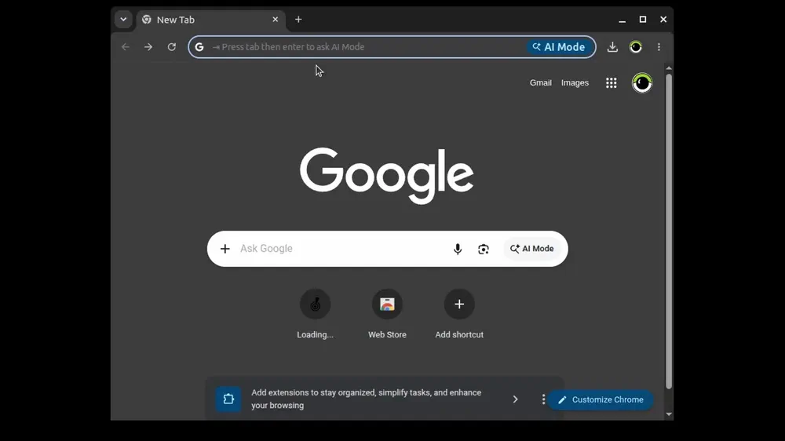
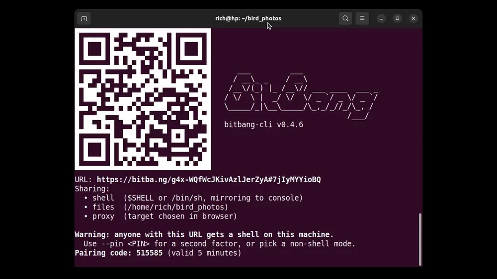
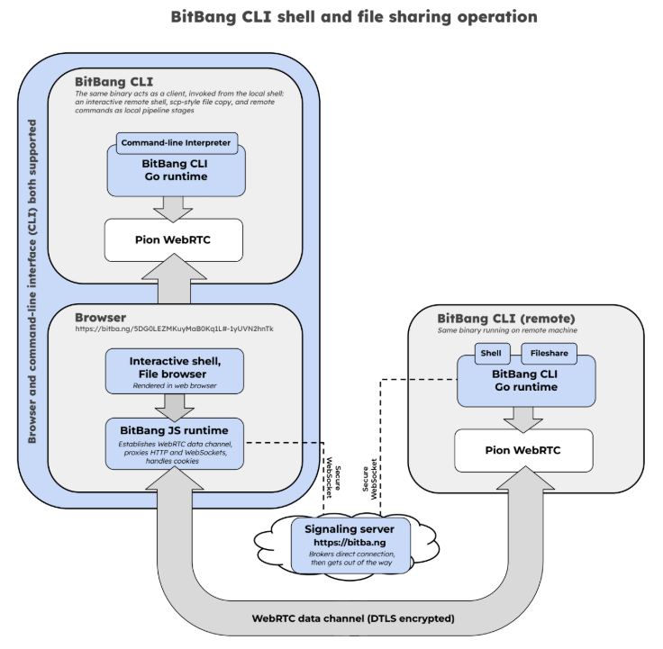
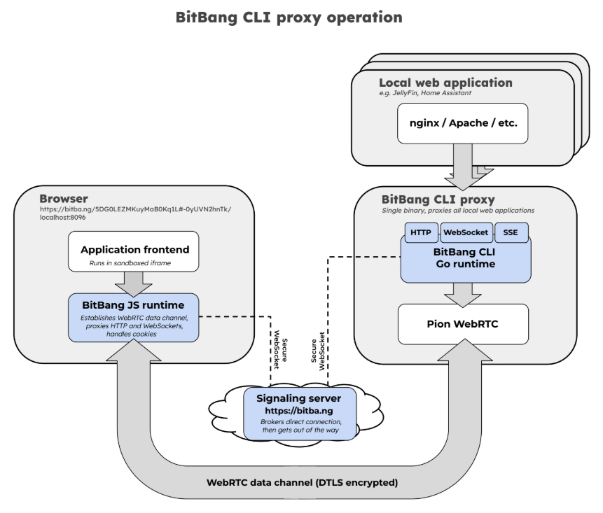

# BitBang CLI

[](https://github.com/richlegrand/bitbang-cli/actions/workflows/tests.yml)


`bitbang` is a single static binary remote-access multitool: open an interactive shell, browse and transfer files, and access web apps on the remote machine's network from any browser, no port forwarding, no configuring, and no account.

## How it compares

|                                    | ngrok               | Cloudflare Tunnel | Tailscale                      | frp                                 | `bitbang`           |
| ---------------------------------- | ------------------- | ----------------- | ------------------------------ | ----------------------------------- | ------------------- |
| Account required                   | Yes                 | Yes               | Yes                            | No                                  | **No**              |
| Install on the connecting side     | No                  | No                | **Yes**                        | No (**Yes** for P2P mode)           | **No** (browser)    |
| End-to-end encrypted               | Not by default      | No                | Yes                            | No -- your server sees traffic      | **Yes**             |
| Data path                          | Their servers       | Their servers     | P2P                            | Your server (P2P optional)          | **P2P**             |
| Self-hostable server (open source) | No                  | No                | No (Headscale is third-party)  | **Yes**                             | **Yes**             |
| Setup before first use             | Account + authtoken | Account + DNS     | Account + login on each device | A public-IP server + TOML both ends | **Run one command** |



On the machine you want to reach:

```
curl -sSfL bitba.ng/install | sh
bitbang serve
```

`serve` prints a URL. Open it in any browser and you get a terminal, a file browser, and a proxy to that machine's network -- or connect from another terminal with `bitbang connect <url>` using the same binary. The connection is end-to-end encrypted and peer-to-peer; the `bitba.ng` server introduces the two ends, then steps aside.

`bitbang` is a single static Go binary. It's part of the [BitBang project](https://github.com/richlegrand/bitbang); this [whitepaper](https://github.com/richlegrand/bitbang/blob/main/whitepaper.md) covers the design in depth.


## Quickie recipes

**Reach a service at home**

- [Mount your home NAS from anywhere (SMB)](https://github.com/richlegrand/bitbang/blob/main/cookbook.md#mount-your-home-nas-from-anywhere-smb)
- [Watch your media library from anywhere (Jellyfin)](https://github.com/richlegrand/bitbang/blob/main/cookbook.md#watch-your-media-library-from-anywhere-jellyfin)
- [Use your own LLM from anywhere (Ollama, Open WebUI)](https://github.com/richlegrand/bitbang/blob/main/cookbook.md#use-your-own-llm-from-anywhere-ollama-open-webui)
- [Check your security cameras (Frigate)](https://github.com/richlegrand/bitbang/blob/main/cookbook.md#check-your-security-cameras-frigate)
- [Reach your home automation without exposing it (Home Assistant)](https://github.com/richlegrand/bitbang/blob/main/cookbook.md#reach-your-home-automation-without-exposing-it-home-assistant)
- [Print to your home printer (IPP, CUPS)](https://github.com/richlegrand/bitbang/blob/main/cookbook.md#print-to-your-home-printer-ipp-cups)

**Get on a machine**

- [Get a shell on a machine behind NAT](https://github.com/richlegrand/bitbang/blob/main/cookbook.md#get-a-shell-on-a-machine-behind-nat)
- [Get a shell from your phone](https://github.com/richlegrand/bitbang/blob/main/cookbook.md#get-a-shell-from-your-phone)
- [Remote desktop into a Windows machine (RDP)](https://github.com/richlegrand/bitbang/blob/main/cookbook.md#remote-desktop-into-a-windows-machine-rdp)
- [Reach a Linux or Mac desktop (VNC)](https://github.com/richlegrand/bitbang/blob/main/cookbook.md#reach-a-linux-or-mac-desktop-vnc)
- [SSH to a machine with no open port (OpenSSH)](https://github.com/richlegrand/bitbang/blob/main/cookbook.md#ssh-to-a-machine-with-no-open-port-openssh)
- [Set up a headless Raspberry Pi](https://github.com/richlegrand/bitbang/blob/main/cookbook.md#set-up-a-headless-raspberry-pi)

**Share with someone else**

Sharing entails simply giving someone a unique URL or QR code that gives them access. Permissions can be tailored and set to expire in minutes, hours, etc. 

- [Share files without uploading them anywhere](https://github.com/richlegrand/bitbang/blob/main/cookbook.md#share-files-without-uploading-them-anywhere)
- [Show someone your project](https://github.com/richlegrand/bitbang/blob/main/cookbook.md#show-someone-your-project)
- [Give someone access that expires](https://github.com/richlegrand/bitbang/blob/main/cookbook.md#give-someone-access-that-expires)
- [Check your agent session from your phone (Claude Code, tmux)](https://github.com/richlegrand/bitbang/blob/main/cookbook.md#check-your-agent-session-from-your-phone-claude-code-tmux)
- [Fix someone else's router](https://github.com/richlegrand/bitbang/blob/main/cookbook.md#fix-someone-elses-router)

**Development and devices**

- [Reach a database from your dev machine (Postgres, MySQL)](https://github.com/richlegrand/bitbang/blob/main/cookbook.md#reach-a-database-from-your-dev-machine-postgres-mysql)
- [Sync devices that cannot find each other (Syncthing)](https://github.com/richlegrand/bitbang/blob/main/cookbook.md#sync-devices-that-cannot-find-each-other-syncthing)
- [Watch a robot from a browser (ROS, Foxglove)](https://github.com/richlegrand/bitbang/blob/main/cookbook.md#watch-a-robot-from-a-browser-ros-foxglove)

**Techniques**

- [What a forwarding listener exposes](https://github.com/richlegrand/bitbang/blob/main/cookbook.md#what-a-forwarding-listener-exposes)
- [Let other machines on your LAN use a forward](https://github.com/richlegrand/bitbang/blob/main/cookbook.md#let-other-machines-on-your-lan-use-a-forward)
- [Known not to work](https://github.com/richlegrand/bitbang/blob/main/cookbook.md#known-not-to-work)

## Using `bitbang`

Every connection has two ends: a **listener** (`bitbang serve`, running on the machine being reached) and a **connector** (a browser, or the `bitbang` CLI, on the machine doing the reaching). One listener URL serves both kinds of connector.

### The listener: `bitbang serve`

```
bitbang serve                    # everything: shell + forward + files + proxy on one URL
bitbang serve shell              # shell only
bitbang serve forward            # TCP forwarding only, for `connect -L`
bitbang serve forward 127.0.0.1:22   # ...restricted to one target
bitbang serve files ~/share      # files only (add -files-upload to allow uploads)
bitbang serve proxy              # proxy; pick the target in the browser
bitbang serve proxy localhost:8080   # ...or pin a single target
```

Each prints a QR code, URL and a pairing code. The mode picks what the
listener can do at all: `serve shell` has no forwarding to grant, and a
forward-only listener never starts a shell, so there is nothing to escalate
to.

One default worth knowing: **forwarding and the proxy reach any host:port the
listener can reach**, not only the one you had in mind, so a link handed out
for a database also reaches the rest of that network. `-allow-forward` and
`-allow-proxy` narrow that, and the positional form above is shorthand for
them.

### Sharing a running session: `bitbang share`

`serve shell` starts a new shell. `share` publishes a tmux session that is
already running:

```
bitbang share                    # publish the current tmux session
bitbang share --read-only        # publish without a control URL
bitbang share status|stop|rotate
```

The command returns after publishing, so `Ctrl-Z`, `bitbang share`, `fg`
works for a task already in progress. Hosting requires tmux 3.2+ on Unix or
WSL. Native Windows clients can open the URLs but cannot host a share.

By default, the command prints two bearer URLs:

- The **Control URL** can type with the same authority as the local keyboard.
  One controller may connect at a time.
- The **View URL** is watch-only. Input is dropped before it reaches tmux, and
  up to `--max-viewers` viewers may connect at once (default 16).

`--read-only` omits the control credential entirely. Viewer and controller
limits are held for each connection's lifetime, even before it opens a shell.

Shares run until stopped by default; `--ttl` sets a lifetime (e.g. `--ttl 1h`).
Share URLs are ephemeral and are never saved to `devices.json`. `share stop`,
TTL expiry, or removal of the source session disconnects remote peers without
stopping the source session.

Re-running `bitbang share` reprints the running share's URLs. If you
pass a flag that disagrees with what is running (say `--read-only`
against a share that has a control URL), it says so rather than
handing back the old URLs; `bitbang share rotate` replaces the share
with one that uses the new flags.

A background worker runs in a detached `_bbshare_*` tmux management session,
so there is no daemon or PID file to manage.

Sharing changes no tmux options. With tmux's default `window-size latest`, the
window follows the active read-write client; a lone viewer still supplies the
only available size. If `window-size` has been overridden, `share` reports it
but does not change the user's configuration.

### Handing out limited access: `bitbang link`

One listener, one URL, and as many **access links** as you need. Each is a
separate code on that same URL, granting a subset of what the listener offers
and optionally lapsing at a fixed time:

```
bitbang link edit                # add entries in $EDITOR
bitbang link ls                  # what you have handed out
bitbang link rm <label>          # revoke one
bitbang link qr <label>          # its URL and QR code
```

An entry is a line of JSON in `~/.bitbang/bitbang/links.json`. Write one with no
code, reload the listener at its console, and it mints one:

```json
[
  {"label": "ana",  "scope": ["files"], "expires": "2026-09-01T00:00:00Z"},
  {"label": "ben",  "scope": ["files"]},
  {"label": "dev",  "scope": ["shell", "forward"]}
]
```

```
  0) owner  files forward proxy shell
     https://bitba.ng/8ach_I7oQk2vBb9xYzT0Lw#_vtQ0JCPe7s
  1) ana    files  expires in 6d
     https://bitba.ng/8ach_I7oQk2vBb9xYzT0Lw#T-Ty_HhvLfY
  2) ben    files
     https://bitba.ng/8ach_I7oQk2vBb9xYzT0Lw#L6La8OzBO74
  3) dev    forward shell
     https://bitba.ng/8ach_I7oQk2vBb9xYzT0Lw#8kmI3LYzB7E
```

`owner` is the identity's own code and grants everything the listener serves; send
one of the others instead. The console takes either the label or the number beside
it, so `rm 2` and `rm ben` do the same thing. `scope` is drawn from `files`, `shell`, `forward`, and
`proxy`, intersected with what the listener actually offers -- a `files` link
cannot open a shell, and says so to anyone who tries. Omit `scope` and the link
grants whatever the listener does.

The label is what identifies a link, not its terms, so two people can hold links
with identical scope and expiry and you can still revoke one without touching the
other.

Revocation and expiry reach sessions that are already open: the connection closes
and the holder is told why, rather than going quiet. And an expired code is
retired rather than paused -- renewing an entry mints a new one, so the URL you
already sent stays dead.

### Pairing with a 6-digit code

When you can't paste a URL or scan a QR code, such as when you're on the phone, or within yelling distance, `bitbang serve` also prints a short **pairing code**. The other party opens `bitba.ng/<code>` (or runs `bitbang connect <code>`), their screen shows a second 6-digit number, and they read *that* one back to you. You type it in to approve. A machine-in-the-middle can't make the two numbers match, and pairing saves the device connection credentials for next time, e.g. `bitbang connect nas1`.  If you know [Magic Wormhole](https://github.com/magic-wormhole/magic-wormhole), the shape is similar -- a spoken code that securely introduces two machines.
	


### Bring your own TURN

Most connections go straight peer-to-peer. When both ends sit behind a NAT that
won't hole-punch, the traffic needs a relay, and by default that's ours. `-ice-servers`
points the listener at your own instead:

```
bitbang serve -ice-servers ~/turn.json
```

The listener hands the config to the signaling server at registration, and the server
gives it to whoever connects -- so both ends use your relay and ours is never involved.
Any coturn, or a hosted provider like Cloudflare or Twilio, works.

The file is JSON, in whichever of these three shapes your provider handed you:

```json
[{"urls": ["turn:turn.example.net:3478"], "username": "user", "credential": "pass"}]
```

```json
{"ice_servers": [{"urls": "stun:stun.example.net:3478"}]}
```

```json
{"iceServers": [{"urls": ["turn:turn.example.net:3478"], "username": "u", "credential": "p"}]}
```

`urls` takes a string or a list; `username` and `credential` are for TURN and can be
left off a STUN-only entry. The path may be absolute, relative, or `~`-rooted. A file
that doesn't parse stops the listener at startup rather than quietly falling back.

If a session ends up relayed without being asked to, `bitbang connect` says so
rather than leaving you to wonder why it feels slow. The listener logs it
either way (`via RELAY`), and `-relay` / `-norelay` force the question one way
or the other when you are diagnosing a path.

Worth saying: this is about who carries the bytes, not who can read them. A relay only
ever sees DTLS ciphertext, ours included. Run your own when you need more TURN than we can provide (we currently limit the time).

### Connecting from a browser

Open the URL. Depending on what's served, you get:

- **Shell** -- a full terminal in the page (colors, resize, copy/paste).
- **Files** -- browse, preview, download, and upload.
- **Proxy** -- type a LAN address (`nas.local`, `192.168.1.10:8080`, `localhost:3000/admin`) and use the app as if you were local. Logins, cookies, uploads, and streaming all work.

<!-- TODO: per-feature demos -->
<!--  -->
<!--  -->

### Connecting from the CLI

```
bitbang connect <url>                                   # interactive shell
bitbang connect <url> -- tail -f /var/log/syslog        # one-shot command
bitbang connect <url> -L 15432:db.internal:5432         # local TCP forwarding
bitbang connect <url> -L 14450:nas.local:445 -L 15900:[fd00::20]:5900
bitbang cp <url>:/var/log/app.log ./app.log             # copy files, scp-style
bitbang cp - <url>:/tmp/firmware.bin < firmware.bin     # stdin/stdout work too
```

`-L` forwards **TCP only**, like `ssh -L`. `-L` binds `127.0.0.1` unless you pass
`-g`, which makes the forwarded port reachable from your local network -- and
anyone who reaches it gets whatever the tunnel reaches, with no BitBang
credential in front of it.

The listener needs `bitbang serve forward` or `bitbang serve`. By default a
`forward` link reaches **any host:port the listener can reach**, not only the
one you had in mind, so a link handed out for a database also reaches the rest
of that network. Narrow it with `-allow-forward`:

```
bitbang serve forward db.internal:5432        # this link reaches one service
```

Every successful connect or pairing is saved to `~/.bitbang/devices.json`, so from then on a short name is enough: `bitbang connect nas1`.

## Platform support

One binary per platform, no runtime dependencies. Everything works
everywhere except the two rows called out below.

|                                          | Linux | macOS | Windows |
| ---------------------------------------- | :---: | :---: | :-----: |
| Shell, files, proxy (`bitbang serve`)     |  yes  |  yes  |   yes   |
| TCP forwarding (`-L`)                     |  yes  |  yes  |   yes   |
| Access links -- scope, expiry, revocation |  yes  |  yes  |   yes   |
| Bring your own TURN                       |  yes  |  yes  |   yes   |
| Pairing with a 6-digit code               |  yes  |  yes  |   yes   |
| The listener console (Enter)              |  yes  |  yes  |   yes   |
| `bitbang connect`, `bitbang cp`           |  yes  |  yes  |   yes   |
| Viewing a shared session                  |  yes  |  yes  |   yes   |
| **Hosting a share** (`bitbang share`)     |  yes  |  yes  |  no *   |
| **Terminal resize while connected**       |  yes  |  yes  |  no **  |

\* `bitbang share` publishes a tmux session, so hosting one needs tmux --
Linux, macOS, or WSL. Native Windows can still open share URLs with
`bitbang connect`.

\*\* A Windows connector does not notice its terminal being resized, so the
remote shell keeps the size it started with until you reconnect. Unix
gets this from `SIGWINCH`, which Windows has no equivalent of.

## Security

- **Self-certifying identity.** On first run, `bitbang` generates an RSA keypair under `~/.bitbang/<program>/`; the device UID is derived from the public key, so impersonating a device means finding a second preimage of its UID.
- **The secret never touches the server.** The access code lives in the URL fragment (`#…`), which browsers never send -- `bitba.ng` brokers the connection without ever seeing the credential that authorizes it.
- **End-to-end encryption.** All traffic rides WebRTC's DTLS. The signaling server sees only the public key, the derived UID, and connection metadata -- never your data. A TURN relay, if one is needed, sees ciphertext only.
- **Verified pairing.** The read-aloud number in code pairing is a short authentication string (SAS), computed independently on both ends from the negotiated DTLS fingerprints and two committed nonces -- a machine-in-the-middle, whose fingerprints necessarily differ, can't make the two numbers match.
- **The URL is a bearer credential.** Anyone who has it gets whatever you chose to serve -- a shell, if you ran `serve shell`. Share it accordingly.
- **Optional PIN** (`--pin`) for permanent or headless setups, and **throwaway mode** (`-ephemeral`) for a fresh identity each run.

How the two ends authenticate each other without trusting the signaling server is covered in detail here: [*Trustless Signaling: Authentication Without a Central Authority*](https://github.com/richlegrand/bitbang/blob/main/trustless-signaling.md).

## Why?

- **Nothing to forward or configure.** Works from behind NAT, CGNAT, or a locked-down network -- no router changes, no VPN, no tunnel daemon.
- **Nothing to install on the connecting side.** A browser is enough. A CLI is there when you want scripting, pipes, and file copy.
- **Private by design.** Traffic is WebRTC/DTLS, peer-to-peer. The signaling server never sees it; if a direct path isn't possible, a TURN relay carries ciphertext only.
- **No account, no telemetry.**


### Why not just use SSH?

`bitbang` is shaped like ssh: `serve`, `connect`, and `cp` map to `sshd`, `ssh`, and `scp`, with WebRTC as the transport instead of TCP. For a machine you can already SSH into comfortably, that difference doesn't buy you much. But most of `bitbang` came out of annoyances I seem to hit more often than I should:

**Reach.** Remote SSH access needs an inbound path, and on most networks opening one isn't your call -- CGNAT (cellular, Starlink, many ISPs), corporate, university, municipal. So in practice you bolt on a second system: Tailscale, a VPN, ngrok -- another install, another account, another daemon to keep running. `bitbang serve` needs no open port and works from anywhere.

**Setup.** SSH has to be enabled and configured before it will let you in. It's disabled by default on Raspberry Pi OS, and often key-only, which means getting your public key onto the machine first. And how do you do that? Email or a USB stick are usually the most painless options. `bitbang` sets up the connection with a 6-digit code exchange instead -- something you can do safely over the phone, or call out across the room. It also runs as an ordinary user -- no root, no daemon, no config file.

**Proxying.** If you want a web app on that machine's network, SSH gives you a separate tunnel per app, named in advance. The `bitbang` proxy is generic: specify the web app's URL at connection time.

**Browser client.** SSH needs an SSH client and a key or password on the connecting side. `bitbang` needs a browser -- which means a phone, a borrowed laptop, or someone who has never opened a terminal. Hand them the URL and they get the access that you've granted them.

## Install

```
curl -sSfL bitba.ng/install | sh
```

Linux and macOS. Detects your OS and arch (`amd64`, `arm64`, and `armv7` on Linux), downloads the binary from the latest [GitHub release](https://github.com/richlegrand/bitbang-cli/releases), verifies its SHA-256 against the release's `checksums.txt`, and installs to `~/.local/bin/bitbang`.

Windows builds are published as `bitbang-windows-amd64.exe` and
`bitbang-windows-arm64.exe`. Download the appropriate binary from Releases,
rename it to `bitbang.exe`, and place it on your `PATH`.
**Build from source:** see [below](#building-from-source).

**macOS and Gatekeeper.** The install one-liner above is unaffected: `curl` does
not set the `com.apple.quarantine` attribute, so the binary it fetches runs
normally. If you instead download `bitbang-darwin-arm64` from the Releases page
in a browser, macOS quarantines it and refuses to open it, because the release
binaries are not notarized. Clear it with either of:

```
xattr -d com.apple.quarantine ./bitbang-darwin-arm64
```

or right-click the file in Finder and choose Open, which offers a one-time
override. Alternatively, build from source, which never quarantines.

### Install options

Pin a version, change the location, or read the script before running it:

```
curl -sSfL bitba.ng/install | sh -s -- --version 0.5.0
curl -sSfL bitba.ng/install | sh -s -- --prefix /usr/local/bin

curl -sSfL bitba.ng/install -o install.sh && less install.sh && sh install.sh
```

Release tags have no `v` prefix (`0.5.0`, not `v0.5.0`).

### How the install URL works

`bitba.ng/install` is a redirect, not a hosted script. The chain:

1. `curl` hits `https://bitba.ng/install`, which 302s to [`install.sh`](install.sh) in this repo (on `main`).
2. The script runs in your shell, detects OS+arch, and downloads the binary asset from `https://github.com/richlegrand/bitbang-cli/releases/latest/download/bitbang-linux-<arch>`.
3. It fetches `checksums.txt` from the same release and verifies the binary's SHA-256.
4. Installs to `~/.local/bin` (overridable).

The install script lives in this repo, next to the code it installs -- so you can review it alongside the binary, and the canonical bitba.ng host owns only the short URL. Self-hosters can point their own host's `/install` at whatever script they ship: the signaling server's `INSTALL_URL` env var controls the redirect target (empty → 404).

## Command reference

Flags accept either form (`-pin` or `--pin`). Boolean flags default off unless noted.

```
bitbang serve [flags]                  Everything: shell + forward + files + proxy on one URL
bitbang serve shell [flags]            Shell only
bitbang serve forward [TARGET …]       TCP forwarding only (TARGETs restrict what it reaches)
bitbang serve files [PATH] [flags]     Files only (PATH defaults to cwd)
bitbang serve proxy [TARGET] [flags]   HTTP/WebSocket reverse proxy (TARGET pins one host:port)
bitbang share [flags]                  Publish a running tmux session
bitbang share status|stop|rotate       Inspect, stop, or replace a share
bitbang connect <target> [-- cmd …]    Client shell (interactive or one-shot)
bitbang cp <src> <dst>                 Copy files (one side is <URL>:/path, or '-')
bitbang version                        Print version (also --version)
bitbang help                           Usage (also --help, -h)
```

### `bitbang serve` -- run a listener

Each mode serves one capability; `serve` serves all four. A positional
argument, where a mode takes one, is shorthand for that mode's flag.

| Mode                        | Serves                          | Positional                     |
| --------------------------- | ------------------------------- | ------------------------------ |
| `serve`                     | shell, forward, files, proxy    | --                             |
| `serve shell`               | shell                           | --                             |
| `serve forward [TARGET …]`  | forward                         | `-allow-forward`, repeatable   |
| `serve files [PATH]`        | files                           | `-files` (default cwd)         |
| `serve proxy [TARGET]`      | proxy                           | `-target`                      |

A flag is only accepted by the modes that serve its capability, so
`serve files -target x` is an error rather than a setting that does nothing.

| Flag                       | Modes                     | Default        | Description                                                                                                          |
| -------------------------- | ------------------------- | -------------- | ---------------------------------------------------------------------------------------------------------------------- |
| `-server HOST`             | all                       | `bitba.ng`     | Signaling server hostname                                                                                            |
| `-pin PIN`                 | all                       | (none)         | Require this PIN for connections                                                                                     |
| `-ephemeral`               | all                       | off            | Temporary identity (a fresh URL each run)                                                                            |
| `-program NAME`            | all                       | `bitbang`      | Identity name; keypair stored at `~/.bitbang/<NAME>/identity.pem`                                                    |
| `-ice-servers PATH`        | all                       | (ours)         | JSON file of your own STUN/TURN servers; see [Bring your own TURN](#bring-your-own-turn)                              |
| `-nocode`                  | all                       | off            | Disable code-exchange pairing -- no 6-digit code is issued; the URL still works. For headless listeners that can't complete the SAS prompt. |
| `-v`                       | all                       | off            | Verbose logging (adds the browser `!debug` overlay)                                                                  |
| `-shell-cmd CMD`           | `serve`, `serve shell`    | platform shell | `$SHELL`/`/bin/sh` on Unix; `%COMSPEC%`/`cmd.exe` on Windows                                                         |
| `-shell-max-sessions N`    | `serve`, `serve shell`    | `10`           | Max concurrent shell sessions (0 = unlimited)                                                                        |
| `-shell-mirror`            | `serve`, `serve shell`    | on             | Mirror shell output to the listener's console. Turn off with `-shell-mirror=false` -- the equals sign is required.    |
| `-shell-restrict`          | `serve`, `serve shell`    | off            | Run only `-shell-cmd`; refuse a command the connector supplies. Without it `-shell-cmd` is a default, which `connect <url> -- cmd` overrides. |
| `-allow-forward HOST:PORT` | `serve`, `serve forward`  | (unrestricted) | A target `connect -L` may reach. Repeatable. See below.                                                              |
| `-files PATH`              | `serve`, `serve files`    | cwd            | Directory (or single file) to share                                                                                  |
| `-files-upload`            | `serve`, `serve files`    | off            | Allow uploads into the shared directory                                                                              |
| `-target HOST:PORT`        | `serve`, `serve proxy`    | (dynamic)      | Pin one proxy target; empty means the target is picked in the browser                                                |
| `-allow-proxy HOST:PORT`   | `serve`, `serve proxy`    | (unrestricted) | A target the browser may pick. Repeatable. See below.                                                                |
| `-proxy-client-ip`         | `serve`, `serve proxy`    | off            | Stamp the real browser IP as `X-Forwarded-For` (fixed-target mode). Enable only when the backend trusts localhost for auth. |

**The allow flags.** Both take `HOST:PORT`, or a bare `HOST` to allow any port
on that host, and both repeat. Targets are matched **as written and never
resolved**: allowing `192.168.1.50:22` does not allow `nas.lan:22` even when
the name points there. Resolving would check a name at one moment and dial it
a moment later, and the two can disagree. Given neither flag, a listener
reaches any host:port it can reach.

```
bitbang serve forward 127.0.0.1:22 db.internal:5432   # two services, nothing else
bitbang serve forward nas.lan                          # any port on one host
```

*(Advanced: `-video-fd N` passes an inherited socketpair FD to an external
video helper; for internal/embedding use, and hidden from `--help`.)*

### `bitbang share` -- publish a running tmux session

| Flag               | Default           | Description                                                  |
| ------------------ | ----------------- | ------------------------------------------------------------ |
| `-read-only`       | off               | Do not generate a control credential                         |
| `-ttl DURATION`    | `0` (no expiry)   | Lifetime up to `8760h`; `0` means until stopped              |
| `-target SESSION`  | enclosing session | Session name or `$id`; required when run outside tmux        |
| `-socket PATH`     | enclosing server  | tmux socket; needed for a non-default server outside tmux    |
| `-max-viewers N`   | `16`              | Maximum concurrent view-only peers                           |
| `-server HOST`     | `bitba.ng`        | Signaling server hostname                                    |
| `-v`               | off               | Verbose logging                                              |

`share status`, `share stop`, and `share rotate` accept the same target and
socket flags. `rotate` also accepts publication flags and issues fresh URLs.

### `bitbang link` -- access links for a listener

| Command                  | What it does                                            |
|--------------------------|---------------------------------------------------------|
| `bitbang link ls`        | List this listener's links: scope, expiry, code          |
| `bitbang link edit`      | Open `links.json` in `$EDITOR`, validated on save        |
| `bitbang link rm LABEL`  | Delete a link (reload the listener to close its sessions)|
| `bitbang link qr LABEL`  | Print a link's URL and QR code                           |

| Entry field | Meaning                                                                      |
|-------------|------------------------------------------------------------------------------|
| `label`     | Names the link; identifies it to `rm` and `qr`, and must be unique             |
| `scope`     | Any of `files`, `shell`, `forward`, `proxy`. Omit for everything the listener serves. `forward` reaches any host:port the listener can reach unless `-allow-forward` narrows it |
| `expires`   | RFC 3339 timestamp. Omit for a link that does not lapse                        |
| `code`      | Filled in by the listener on reload. Leave it out to have one minted           |

`--program NAME` picks a listener other than the default, matching `serve
--program`.

### `bitbang connect <target> [-- command …]` -- client shell

`<target>` may be any of:

- a **saved name** -- e.g. `nas1`; resolved from the known-hosts table (see below)
- a **6-digit pair code** -- e.g. `482731`; runs the pairing flow, then connects
- a **URL** -- `https://bitba.ng/<id>#<code>`, `bitba.ng/<id>#<code>`, or bare `<id>#<code>`

With no `-- command`, opens an interactive shell (a PTY when stdin is a terminal). With `-- command args…`, runs that single command non-interactively and exits with its status (signal exits report 128).

| Flag                                    | Default    | Description                                                                                                 |
| --------------------------------------- | ---------- | ----------------------------------------------------------------------------------------------------------- |
| `-L LOCAL_PORT:REMOTE_HOST:REMOTE_PORT` | (none)     | Forward `LOCAL_PORT` to `REMOTE_HOST:REMOTE_PORT` without a shell. TCP only (repeatable; bracket IPv6 hosts) |
| `-g`                                    | off        | Bind forwarded ports on `0.0.0.0` instead of `127.0.0.1`                                                   |
| `-name NAME`                            | (auto)     | Remember this host under NAME (new hosts only; auto-assigns `device<N>` if omitted)                         |
| `-relay`                                | off        | Request a TURN relay up front instead of only on fallback (ICE still prefers a direct path if one succeeds) |
| `-norelay`                              | off        | Refuse STUN/TURN entirely -- host candidates only, so a connection that would need a relay fails instead. Answers whether the direct path actually works. |
| `-pin PIN`                              | (prompt)   | PIN to send if the listener requires one (skips the interactive prompt)                                     |
| `-timeout DUR`                          | `30s`      | Dial timeout (e.g. `45s`, `1m`)                                                                             |
| `-server HOST`                          | `bitba.ng` | Signaling server -- **pair-code mode only**; the URL form carries its own host                              |
| `-v`                                    | off        | Verbose logging                                                                                             |

### `bitbang cp <src> <dst>` -- copy files

Exactly one of `<src>` / `<dst>` is remote, written `<URL>:/path` (URL in any form accepted by `connect`). `-` means stdin/stdout, so `cp <URL>:/f -` streams to stdout and `cp - <URL>:/f` uploads from stdin. A trailing `/` or `.` on the local side keeps the remote basename (scp-style).

| Flag           | Default  | Description                                     |
| -------------- | -------- | ----------------------------------------------- |
| `-relay`       | off      | Request a TURN relay up front (as in `connect`) |
| `-pin PIN`     | (prompt) | PIN to send if required                         |
| `-timeout DUR` | `30s`    | Dial timeout                                    |
| `-v`           | off      | Verbose logging                                 |

### Device names & the known-hosts table

Every successful connect or pairing is remembered in `~/.bitbang/devices.json` (mode `0600`), so you can reconnect by a short name instead of a URL or code:

```
bitbang connect 482731 -name nas1     # pair once, save it as "nas1"
bitbang connect nas1                  # thereafter, just the name
```

- **`-name NAME`** chooses the name; it applies only to a *new* host. Without it, an auto name (`device1`, `device2`, …) is assigned and printed (`Saved as "device1".`).
- **Naming rules:** a name must start with a letter and contain only letters, digits, `-`, or `_`. That guarantees it can never be mistaken for a 6-digit code or a URL. Lookups and uniqueness are case-insensitive.
- **No renaming via connect:** `bitbang connect nas1 -name nas2` is rejected -- `-name` is for first-time saves only.
- **When it's saved:** a pairing is recorded as soon as the SAS is verified (so a flaky reconnect doesn't lose it); a URL connect is recorded once connected.
- Each entry stores `{name, uid, access_code, server, paired_at}`. Reconnecting a known host (by name or URL) refreshes it in place and keeps the name.

## Building from source

Requires Go 1.25+. Pure Go, statically linked (`CGO_ENABLED=0`) -- trivial cross-compilation, no runtime dependencies.

```
go build ./cmd/bitbang/

# cross-compile:
GOOS=linux   GOARCH=arm64        go build -o bitbang-arm64 ./cmd/bitbang/
GOOS=linux   GOARCH=arm GOARM=7  go build -o bitbang-armv7 ./cmd/bitbang/
GOOS=windows GOARCH=amd64        go build -o bitbang.exe   ./cmd/bitbang/
GOOS=darwin  GOARCH=arm64        go build -o bitbang-macos ./cmd/bitbang/
```

From Windows Command Prompt:

```bat
go build -o bitbang.exe .\cmd\bitbang
go test .\...
run_tests.cmd unit
```

Shell commands, file sharing, proxying, and the CLI client are supported on
Windows. Interactive browser and CLI shells use Windows ConPTY, including
terminal input echo, line editing, VT output, and resize events. ConPTY requires
Windows 10 version 1809 or Windows Server 2019 or later.

## Diagrams

<p align="center">
  
    
</p>

## Roadmap

Shipping today: **shell, files, and proxy**, reachable from the browser or the CLI, plus **TCP port forwarding**, scp-style file copy, **ad-hoc pairing** with a saved device table, **terminal sharing** (`bitbang share`), and **access links** (`bitbang link`) that scope and expire what a URL grants. Designed and on the way:

- **Serial bridging** -- drive a remote `/dev/ttyUSB0` from a local virtual port (e.g. run Arduino IDE over the internet). An issue has been opened [here](https://github.com/richlegrand/bitbang-cli/issues/3).
- **Remote desktop** -- screen over a WebRTC video track, keyboard/mouse over the data channel.

## License

MIT -- see [LICENSE](LICENSE).

## Contributing

Issues and PRs welcome.

Recipes are different: they live in the [cookbook](https://github.com/richlegrand/bitbang/blob/main/cookbook.md),
in the [bitbang](https://github.com/richlegrand/bitbang) repo, because they span
every project rather than this one. Adding a recipe is a PR there.

Getting it *listed* is a second, small PR per project whose README should surface
it -- the [Recipes](#recipes) list above is maintained here by hand. That is
deliberate: each project decides which recipes are worth putting in front of its
own readers, rather than every README growing every recipe.
